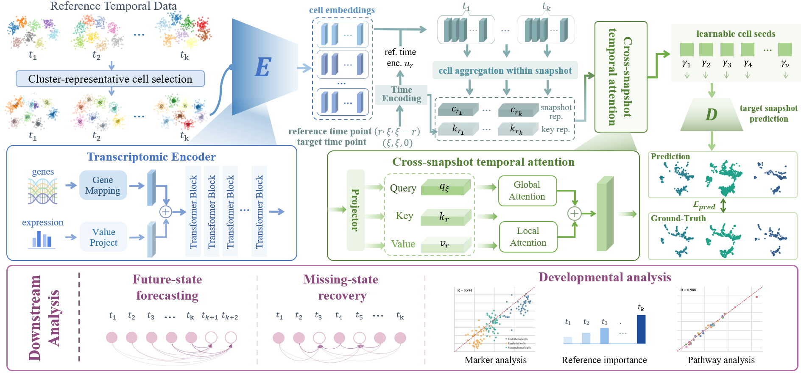

# scChronos: Hierarchical Temporal Context Learning for Missing Snapshot Prediction in Single-Cell Time Series

**scChronos** is a hierarchical temporal context learning framework for missing single-cell snapshot prediction in single-cell time series.





------

## Key Innovations

- **Cluster-representative cell transcriptomic encoding**
- **Cluster-representative-cell-to-snapshot temporal aggregation**
- **Dual-branch snapshot context fusion** 

------

## Repository Structure

```
scChronos/
├── scchronos/
│   ├── __init__.py
│   ├── data.py
│   ├── evaluate.py
│   ├── foundation.py
│   ├── losses.py
│   ├── model.py
│   ├── train_utils.py
│   └── vocab.py
├── scripts/
│   ├── train_scchronos.py
│   └── predict_scchronos.py
├── requirements.txt
├── pyproject.toml
├── LICENSE
└── README.md
```

------

## Dataset Descriptions

| **Dataset**                    | **Species**            | **Tasks**                                                    | **Description** |
| -------------------------------| ---------------------- | ------------------------------------------------------------ |  ------------------------------------------------------------ | 
| **Schiebinger2019**            | Mouse                  | Recovery / Forecasting                                    | Time-resolved single-cell reprogramming dataset |
| **ECED_Kidney** | Mouse        | Recovery / Forecasting | Embryonic kidney developmental time-series dataset |
| **Veres**                      | Human                  | Recovery / Forecasting                          | Human differentiation-related single-cell time-series dataset |
| **Cao2020**                    | Human                  | Recovery / Forecasting                           | Human fetal developmental single-cell time-series dataset |


## Quick Start
### Installation
```
git clone git@github.com:yjs193/scChronos.git
cd scChronos
conda create -n scchronos python=3.11 -y
conda activate scchronos
pip install -r requirements.txt
```

### Training

```
CUDA_VISIBLE_DEVICES=0 python scripts/train_scchronos.py \
  --wandb
```

Expected data layout:

```
Data/
├── vocab/
│   ├── mouse/mouse_gene_vocab.json
│   └── human/updated_gene_vocab.json
├── mouse/
└── human/

```


### Prediction

```
CUDA_VISIBLE_DEVICES=0 python scripts/predict_scchronos.py \
  --checkpoint "" \
  --output-dir ""
```
